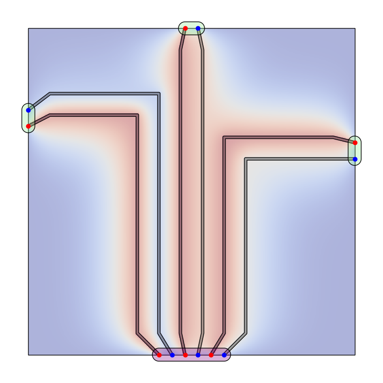
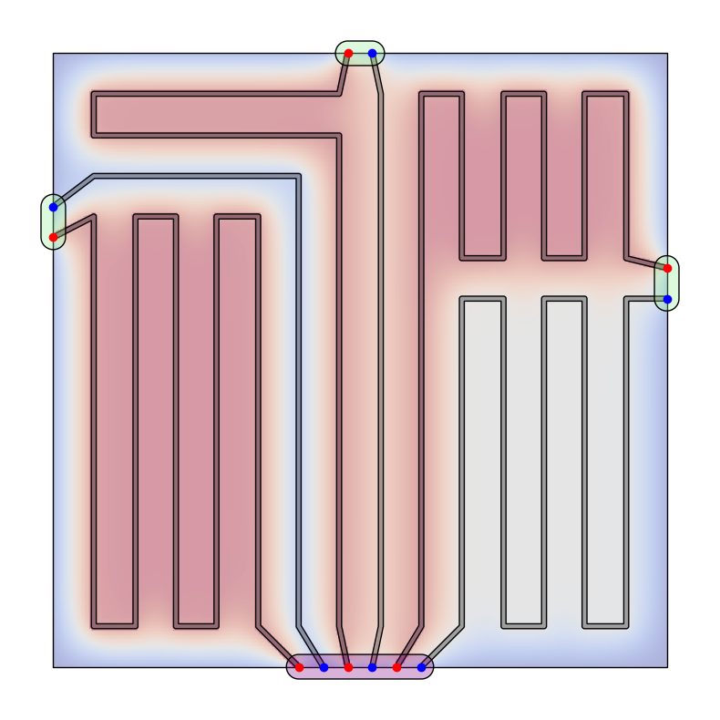

# Opti-Pipe

> Warning! This is a Prototype Implementation only. **Expect Bugs**


A Python library for optimizing underfloor heating pipe layouts in rooms with heat distribution simulations.

> **Jumpstart:** Have a look at **./jupyter/proof.ipynb** 

## Overview

Opti-Pipe is a specialized tool for designing efficient pipe routing systems for underfloor heating. It provides algorithms to:

1. Model floor spaces with distributors and room connections
2. Create optimal pipe routing between distributors and rooms
3. Visualize heat distribution across the floor area
4. Optimize pipe layouts for maximum floor coverage

## Features

- **Graph-Based Routing**: Discretizes floor space into a grid to enable advanced routing algorithms
- **Multiple Routing Strategies**:
  - **Naive Router**: Direct path routing using centerline guidance
  - **Heuristic Router**: Advanced algorithm that maximizes floor coverage by finding longer paths
- **Heat Distribution Visualization**: GPU-accelerated heat diffusion simulation to visualize warming patterns
- **Flexible Configuration**: YAML-based configuration system for customizing all aspects of the model

## Installation

```bash
# Clone the repository
git clone https://github.com/felixscode/opti-pipe.git
cd opti-pipe

# Install dependencies
pip install -e .
```

## Quick Start

> Have a look at **./jupyter/proof.ipynb** to get a more detailed overview


```python
from opti_pipe import Model, Floor, Distributor, Node, NodeType, RoomConnection
from opti_pipe.utils import load_config
from opti_pipe.router import NaiveRouter, HeuristicRouter

# Load configuration
config = load_config()

# Create a floor area
floor = Floor(config=config, corners=[(0,0), (0,5), (5,5), (5,0)])

# Set up distributor with input/output nodes
distributor = Distributor(
    config=config, 
    nodes=(
        Node(config, 2.0, 0, node_type=NodeType.INPUT),
        Node(config, 2.2, 0, node_type=NodeType.OUTPUT),
        # Add more nodes as needed
    ),
    heat_per_node=1.0
)

# Define room connections
room_connections = (
    RoomConnection(
        config, 
        output=Node(config, 0, 3.75, node_type=NodeType.OUTPUT),
        input=Node(config, 0, 3.5, node_type=NodeType.INPUT),
        heat_loss=0.8
    ),
    # Add more room connections as needed
)

# Create model
model = Model(
    config=config,
    target_heat_input=100,
    floor=floor,
    distributor=distributor,
    room_connections=room_connections
)

# Add graph representation with specific grid size
model.add_graph(grid_size=0.2)

# Route pipes using heuristic router
router = HeuristicRouter(config, model, grid_size=0.2)
routed_model = router.route()

# Render with heat distribution
routed_model.render(show_graph=False, render_heat_distribution=True)
```

## Example Results

The library generates visualizations that show:
- Floor layout with distributor and room connections
- Grid-based graph representation for routing
- Pipe routing paths
- Heat distribution across the floor

## Configuration

Configuration is loaded from `data/config.yaml` and includes settings for:

```yaml
pipe:
  color: black
  width: 0.02
floor:
  fill_color: white
  edge_color: black
  edge_width: 1
distributor:
  buffer_radius: 0.1
  # more settings
heat:
  resolution: 0.01
  conv_iterations: 100
  conv_kernel_size: 33
# and more components
```

## How It Works

1. **Floor Modeling**: Create a model with floor dimensions, distributor location, and room connections
2. **Graph Creation**: Discretize the floor space into a grid-based graph
3. **Path Finding**:
   - Naive Router: Uses Dijkstra's shortest path with centerline guidance
   - Heuristic Router: First generates naive routes, then improves them by routing through unused areas
4. **Heat Distribution**: Uses GPU-accelerated convolution to simulate heat diffusion from pipes

## Components

### Models

- **Floor**: Defines the floor area using corner coordinates
- **Node**: Represents connection points (inputs/outputs)
- **Distributor**: Contains input/output node pairs that supply heat
- **RoomConnection**: Pairs of nodes for room-to-room connections with heat loss properties
- **Pipe**: Connects nodes with a geometric path that distributes heat
- **Graph**: Discretizes the floor into a grid of nodes for path finding

### Routers
#### **NaiveRouter**: 
### **NaiveRouter**: 

Short path which is easy to layout and visually appealing.

Creates direct paths following centerlines between distributors and room connections.  
The implementation utilizes NetworkX's Dijkstra algorithm with a custom weight function to route through the graph.


#### **HeuristicRouter**: 

Utilizes naive routes but maximizes floor coverage using DFS-based pathfinding.  
The core algorithm is a simple recursive function with backtracking, which traverses the search tree.  
Node selection and pruning are done via heuristic weights.

The algorithm uses the concepts of laziness/generators to return all solutions.  
Retrieving all solutions is not feasible.  
Therefore, a time budget is granted within which as many solutions as possible are calculated using different strategies.  
Finally, the best one is returned.



### Heat Distribution

Uses convolution operations (with GPU acceleration when available) to simulate heat diffusion from pipes throughout the floor space.

> Note! The Heat Distribution is a rough estimation only

## Dependencies

- NumPy
- Matplotlib
- NetworkX
- Shapely
- PyTorch
- SciPy

## TODOS

- [ ] Test non-rectangular rooms
- [ ] Improve DFS weight function and tree pruning to enhance speed
- [ ] Calculate the heat distribution in a faster language (NIM, C, or Rust)
- [ ] Test edge cases and increase robustness against invalid user model definitions
- [ ] Find a more generalistic algorithmic approach to improve results

## License

MIT License

## Author

Spring 2025 <br>
Felix Schelling <br>
[felixschelling.com](https://felixschelling.com)  
[GitHub Repository](https://github.com/felixscode/opti-pipe)

